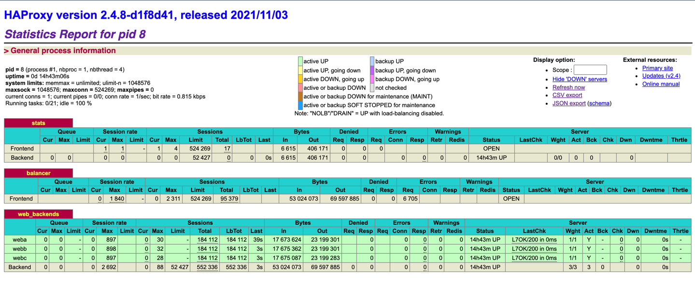

# Docker 练习

1.Dockerfile 语法学习，并生成一个镜像

- [docker中文文档](http://www.dockerinfo.net/dockerfile%e4%bb%8b%e7%bb%8d)
- 常用指令
    - FROM
        - `格式：FORM <image> | FROM <image>:<tag>`
        - `第一条指令必须为 FROM 指令。并且，如果在同一个Dockerfile中创建多个镜像时，可以使用多个 FROM 指令（每个镜像一次）`

    - MAINTAINER
        - `格式：FMAINTAINER <name>`
        - `指定维护者信息`

    - WORKDIR
        - `格式：WORKDIR /path/to/workdir`
        - `为后续的 RUN、CMD、ENTRYPOINT 指令配置工作目录`

    - USER
        - `格式：USER daemon`
        - `指定运行容器时的用户名或 UID，后续的 RUN 也会使用指定用户`

    - VOLUME
        - `格式：VOLUME ["/data"]`
        - `创建一个可以从本地主机或其他容器挂载的挂载点，一般用来存放数据库和需要保持的数据等`

    - COPY
        - `格式：COPY <src> <dest>`
        - `复制本地主机的 <src>（为 Dockerfile 所在目录的相对路径）到容器中的 <dest>`

    - ADD
        - `格式：ADD <src> <dest>`
        - `该命令将复制指定的 <src> 到容器中的 <dest>。 其中 <src> 可以是Dockerfile所在目录的一个相对路径；也可以是一个 URL；还可以是一个 tar 文件（自动解压为目录）`

    - CMD
        - `格式：CMD ["executable","param1","param2"] | CMD ["executable","param1","param2"]`
        - `指定启动容器时执行的命令，每个 Dockerfile 只能有一条 CMD 命令。如果指定了多条命令，只有最后一条会被执行`
        - `如果用户启动容器时候指定了运行的命令，则会覆盖掉 CMD 指定的命令`

- 我们写一个go的http服务 main.go 编译 为 http-demo
```
package main

import "net/http"

func main() {
	http.HandleFunc("/", func(w http.ResponseWriter, r *http.Request) {
		w.Write([]byte("hey boy"))
	})
	err := http.ListenAndServe(":80", nil)
	if err != nil {
		panic(err)
	}
}

```
- 编写一个基于 ubuntu18.04的 Dockerfile
```
FROM ubuntu:18.04
WORKDIR /code
ADD . /code
RUN chmod -R 777 /code
EXPOSE 80
CMD ["./start.sh","/bin/bash"]
```
- 编译生成镜像
```
docker build -t http:01 .
{http:01} 镜像名称:版本 
最后一个点需要注意
```
- 运行镜像
```
docker run -d -p 80:80 http:01
-d 守护进程
-p 80:80 映射端口:容器端口 镜像名称：版本
```
- 访问镜像实例
```
127.0.0.1

```

2.使用docker-compose生成运行容器
- 我们用之前的 http demo 指定 3 个 web 容器，以及 1 个 haproxy 容器来做一个 demo
- 1）安装 docker-compose
```
apt-get install docker-compose
```
- 2）生成 haproxy 目录，在其中生成一个 haproxy.cfg 文件
```
global
  log 127.0.0.1 local0
  log 127.0.0.1 local1 notice

defaults
  log global
  mode http
  option httplog
  option dontlognull
  timeout connect 5000ms
  timeout client 50000ms
  timeout server 50000ms

listen stats
    bind 0.0.0.0:70
    stats enable
    stats uri /

frontend balancer
    bind 0.0.0.0:80
    mode http
    default_backend web_backends

backend web_backends
    mode http
    option forwardfor
    balance roundrobin
    server weba weba:80 check
    server webb webb:80 check
    server webc webc:80 check
    option httpchk GET /
    http-check expect status 200


```
- 3）编写 docker-compose.yml 文件
```
weba:
  build: ./web
  expose:
    - 80

webb:
  build: ./web
  expose:
    - 80

webc:
  build: ./web
  expose:
    - 80

haproxy:
  image: haproxy:latest
  volumes:
    - /root/www/compose-haproxy-web/haproxy:/haproxy-override
    - /root/www/compose-haproxy-web/haproxy/haproxy.cfg:/usr/local/etc/haproxy/haproxy.cfg:ro
  links:
    - weba
    - webb
    - webc
  ports:
    - "80:80"
    - "70:70"
  expose:
    - "80"
    - "70"

```
- 4）目录结构如下
```
├── docker-compose.yml
├── haproxy
│   └── haproxy.cfg
└── web
    ├── Dockerfile
    ├── http-demo
    ├── http.out
    └── start.sh
```
- 5） 在该目录执行 docker-compose up || docker-compose up -d
```
访问 web 服务 127.0.0.1，请求会被haproxy 分发到不同的容器  
访问 happroxy 统计服务 127.0.0.1:70   

```